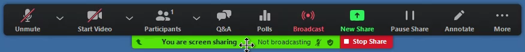
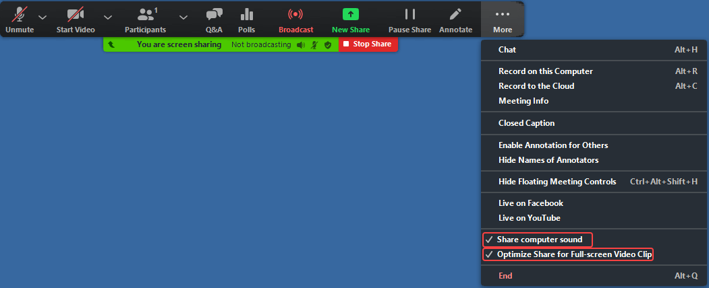
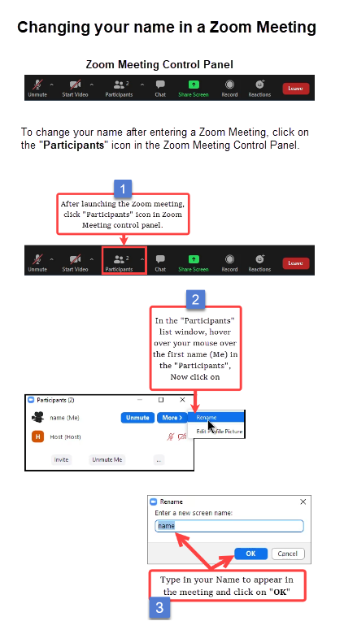
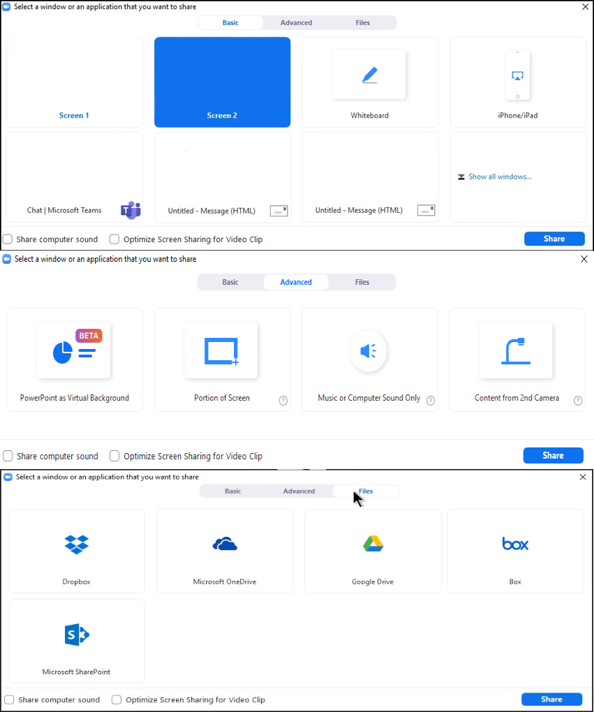

# Zoom Meeting/Webinar Info

---
# Snapshot

### Host webinar control panel menu: 
---
### Host webinar enable PC Sound and Video Clip: 
---

### Rename screen name 

### Share Options 
---

## Disclaimer
This example is only a sample and is **NOT guaranteed to be bug free and production quality**.

***The sample are meant to:***
- Illustrate how to use it. 
- Serve as an example of the step by step process of personal use.

